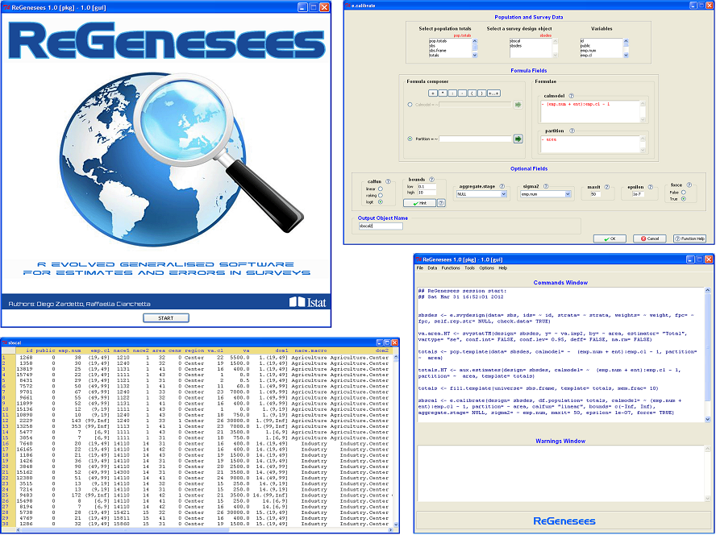

[](http://www.awesomeofficialstatistics.org)

# ReGenesees.GUI 

**ReGenesees.GUI** provides a Graphical User Interface for the [ReGenesees](https://github.com/DiegoZardetto/ReGenesees) package, based on tcltk.

It has been developed for users who might prefer to interact with [ReGenesees](https://github.com/DiegoZardetto/ReGenesees) through a user-friendly mouse-click graphical interface (rather than through R's command line).


## Installation
You can install the **development version** of ReGenesees.GUI from [GitHub](https://github.com/DiegoZardetto/ReGenesees.GUI) as follows:

```r
install.packages("devtools")
devtools::install_github("DiegoZardetto/ReGenesees")
devtools::install_github("DiegoZardetto/ReGenesees.GUI")
```

The **last released version** of ReGenesees.GUI can be downloaded from [Istat website](https://www.istat.it/en/tools/methods-and-it-tools/processing-tools/regenesees) or from the [European Commission platform Joinup]( https://joinup.ec.europa.eu/solution/regenesees-system/releases) (where **older versions** are available too).


## Sample GUI Screenshots

  


## Sponsors
The ReGenesees project was conceived in **Istat** in late 2006, and Istat has been ReGenesees' primary sponsor ever since.

From April 2021, development, maintenance and support of ReGenesees are also actively sponsored by the **World Bank**.
